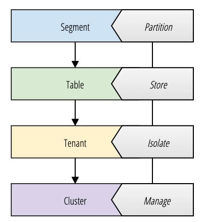
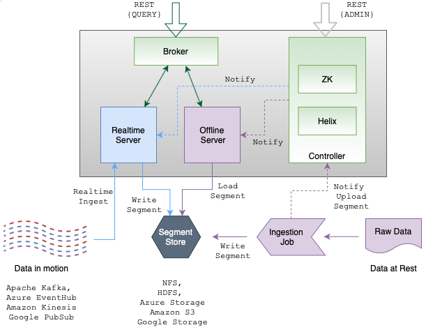
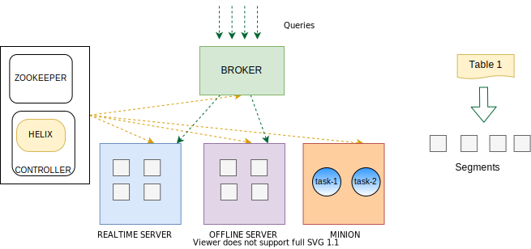
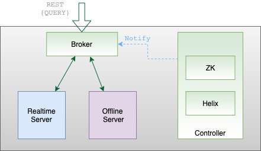
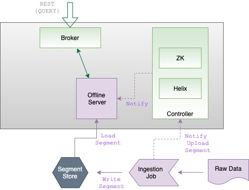
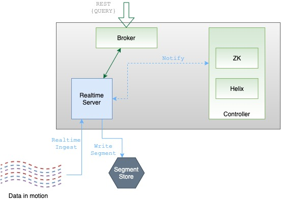
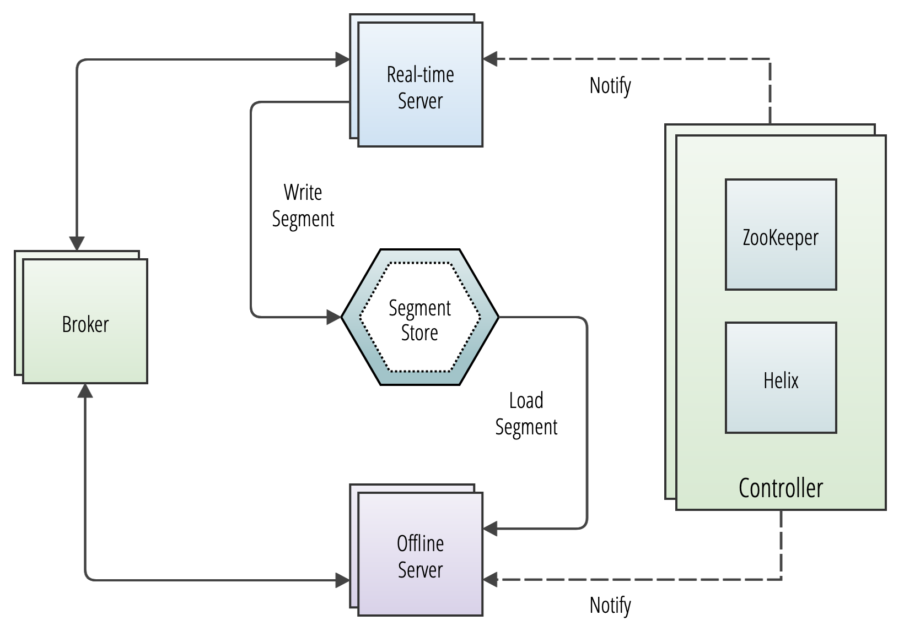
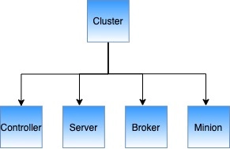
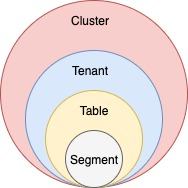

### Run the following command to launch all the containers

```bash
. start.sh
```

### Run the following command to stop the containers

```bash
. stop.sh
```

### Create a Kafka Topic

```bash
. run.sh; createTopic
```

### Upload schema and table

```bash
. run.sh; createTable
```

### Publish messages to the target topic

```bash
. run.sh; publishMessages
```

### Query the Table

```bash
. run.sh; query
```

# Apache Pinot

## Table of Contents

1. [Introduction](#Introduction)
2. [Use Case](#Use-Case)
3. [Concepts](#Concepts)

   1. [Pinot Storage Model](#Pinot-Storage-Model)

4. [Architecture](#Architecture)

   1. [Design principles](#Design-principles)
   2. [Core Components](#Core-Components)
      1. [Apache Helix and Zookeeper](#Apache-Helix-and-Zookeeper)
      2. [Controller](#Controller)
      3. [Broker](#Broker)
      4. [Server](#Server)
      5. [Minion](#Minion)

5. [Other Components](#Other-Components)
   1. [Cluster](#Cluster)
   2. [Tenant](#Tenant)
   3. [Schema](#Schema)
   4. [Table](#Table)
   5. [Deep Store](#Deep-Store)

## Introduction

Pinot is a real-time distributed OLAP datastore, purpose-built to provide ultra low-latency analytics, even at extremely high throughput. It can ingest directly from streaming data sources - such as Apache Kafka and Amazon Kinesis - and make the events available for querying instantly. It can also ingest from batch data sources such as Hadoop HDFS, Amazon S3, Azure ADLS, and Google Cloud Storage.

## Use Case

Pinot is designed to execute OLAP queries with low latency. It is suited in contexts where fast analytics, such as aggregations, are needed on immutable data, possibly, with real-time data ingestion.

## Concepts

Pinot is designed to deliver low latency queries on large datasets. In order to achieve this performance, Pinot stores data in a columnar format and adds additional indices to perform fast filtering, aggregation and group by.

Raw data is broken into small data shards and each shard is converted into a unit known as a segment. One or more segments together form a table, which is the logical container for querying Pinot using SQL/PQL.

### _Pinot Storage Model_

Pinot uses a variety of terms that can refer to either abstractions that model the storage of data or infrastructure components that drive the functionality of the system.



## Architecture

Uses distributed systems architecture that allows Pinot to scale the performance of queries linearly based on the number of nodes in a cluster



### _Design principles_

- Highly available
- Horizontally scalable
- Latency vs Storage
- Immutable data
- Dynamic configuration changes

### _Core Components_



Pinot has multiple distributed system components:

- [Controller](#Controller)
- [Broker](#Broker)
- [Server](#Server)
- [Minion](#Minion)

#### _cluster management tool:_ Apache Helix

#### _Coordination and maintaining the overall cluster state and health:_ Apache ZooKeeper

#### Apache Helix and Zookeeper

Pinot uses Apache Helix for cluster management. Helix is embedded as an agent within the different components and uses Apache Zookeeper for coordination and maintaining the overall cluster state and health.

- All Pinot servers and brokers are managed by Helix

- Helix is a generic cluster management framework to manage partitions and replicas in a distributed system

#### Controller

The Pinot Controller is responsible for the following:

- Maintaining global metadata of the system with the help of Zookeeper which is used as the persistent metadata store.

* Hosting the Helix Controller and managing other Pinot components (brokers, servers, minions)
* Maintaining the mapping of which servers are responsible for which segments
* Serving admin endpoints for viewing, creating, updating, and deleting configs
* Serving endpoints for segment uploads, which are used in offline data pushes.
* Undertaking other management activities such as managing retention of segments, validations.

##### Controller periodic tasks

- BrokerResourceValidationManager
- StaleInstancesCleanupTask
- OfflineSegmentIntervalChecker
- PinotTaskManager
- RealtimeSegmentValidationManager
- RetentionManager
- SegmentRelocator
- SegmentStatusChecker
- TaskMetricsEmitter

#### Broker

- Brokers handle Pinot queries.
- Accept queries from clients and forward them to the right servers.
- Collect results back from the servers and consolidate them into a single response, to send back to the client.



Pinot Brokers are modeled as Helix Spectators

#### Server

- Servers host the data segments.
- Serve queries off the data they host.

There are two types of servers:

##### Offline

Offline servers are responsible for downloading segments from the segment store, to host and serve queries off. When a new segment is uploaded to the controller, the controller decides the servers (as many as replication) that will host the new segment and notifies them to download the segment from the segment store. On receiving this notification, the servers download the segment file and load the segment onto the server, to server queries off them.



##### Real-time

Real-time servers directly ingest from a real-time stream (such as Kafka, EventHubs). Periodically, they make segments of the in-memory ingested data, based on certain thresholds. This segment is then persisted onto the segment store.



#### Minion

A Minion is a standby component that leverages the Helix Task Framework to offload computationally intensive tasks from other components.

Some typical minion tasks are:

- Segment creation
- Segment purge
- Segment merge

## Components



### [Controller](#Controller)

### [Broker](#Broker)

### [Server](#Server)

### [Minion](#Minion)

### _Cluster_

Cluster is a set of nodes comprising of servers, brokers, controllers and minions.



Pinot uses Apache Helix for cluster management. Helix is a cluster management framework that manages replicated, partitioned resources in a distributed system. Helix uses Zookeeper to store cluster state and metadata.

#### Cluster components

Helix divides nodes into logical components based on their responsibilities:

- Participant: Pinot Servers are modeled as Participants
- Spectator: Pinot Brokers are modeled as Spectators
- Controller: Pinot Controllers are modeled as Controllers

#### Logical view

Another way to visualize the cluster is a logical view, where:

- A cluster contains tenants
- Tenants contain tables
- Tables contain segments



### _Tenant_

- Tenant is a logical component defined as a group of server/broker nodes with the same Helix tag.
- A table is associated with a tenant.
- All tables belonging to a particular logical namespace are grouped under a single tenant name and isolated from other tenants.

### _Schema_

Each table in Pinot is associated with a Schema. A schema defines what fields are present in the table along with the data types.

The schema is stored in the Zookeeper, along with the table configuration.

- Categories
- Dimension
- Metric
- DateTime

### _Table_

- Similar to traditional databases
- A logical abstraction to refer to a collection of related data
- It is composed of columns and rows
- The columns, data types, and other metadata related to the table are defined using a schema.
- Pinot breaks a table into multiple segments
- Stores these segments in a deep-store

### _Segment_

- A segment is a horizontal shard representing a chunk of table data with some number of row
- The segment stores data for all columns of the table
- Each segment packs the data in a columnar fashion, along with the dictionaries and indices for the columns.

### _Deep Store_

- The deep store (or deep storage) is the permanent store for segment files.
